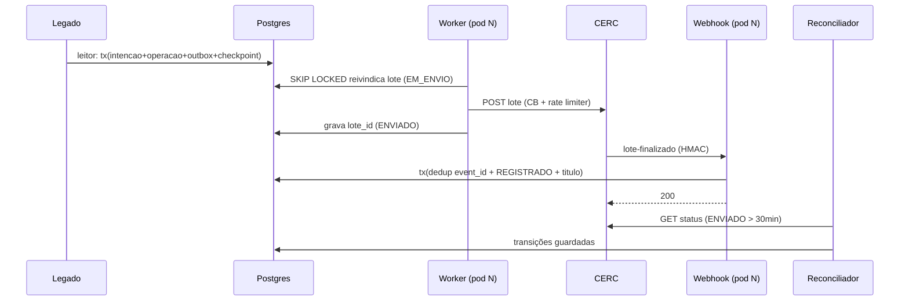
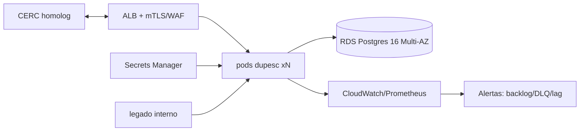
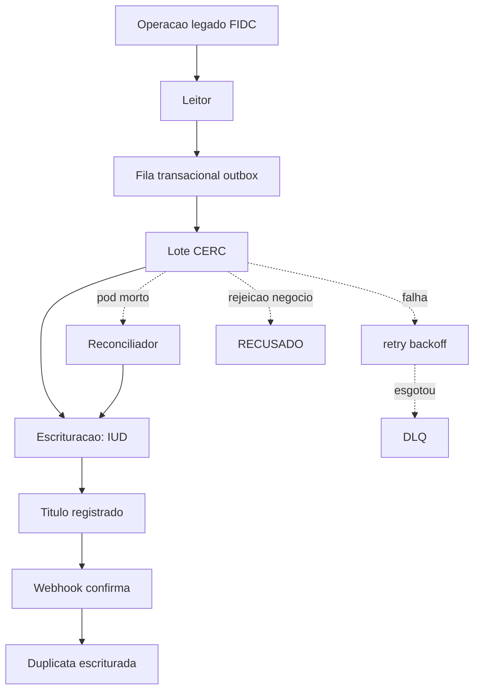

# dupesc — escrituração de duplicatas

Serviço que lê operações não pagas de um endpoint legado e as registra como duplicata
escritural nas registradoras (CERC primeiro; B3 e Núclea depois). POC pronta para
produção: não perde webhook, não duplica, escala horizontalmente.

## Diagramas

### Sequência



### Infraestrutura



### Caso de uso



## Provisionar em produção

- **Compute**: N pods stateless (ECS Fargate ou K8s Deployment), autoscaling por
  profundidade da fila (`outbox` PENDENTE). CPU/DDR modestos — o gargalo é a CERC (80 req/s).
- **Banco**: 1× RDS PostgreSQL 16 Multi-AZ, criptografia, PITR. Nada além disso — fila e
  DLQ são tabelas.
- **Secrets**: Secrets Manager (OAuth CERC client_id/secret, webhook secret, credencial do banco).
- **Ingresso**: ALB público para `/webhook/*` com healthcheck `/actuator/health`,
  mTLS + IP allowlist em produção; WAF.
- **Observabilidade**: Prometheus/Grafana (ou CloudWatch) sobre `/actuator/prometheus`;
  alertar nas métricas do AlertaJob: fila > 10k, item pendente > 15 min, DLQ > 0.
- **Homologação**: CERC tem produção assistida (mesma grade da homolog); basta trocar
  `DUPE_CERC_BASE_URL`/`DUPE_CERC_TOKEN_URL` — nenhum código novo.

## Padrões

| Padrão | Onde |
|---|---|
| Transactional outbox | leitor grava intencao+operacao+outbox na mesma transação |
| Fila SKIP LOCKED com lease | worker reivindica `FOR UPDATE SKIP LOCKED` + `claimed_until` |
| Advisory lock | jobs singleton (leitor 741001, reconciliador 741002) |
| Idempotência por unique constraint | `event_id`, `operacao_legado_id`, `referencia_externa`, `operation_id` |
| Circuit breaker + rate limiter | Resilience4j por registradora; 423/429 nunca esgotam tentativas |
| Reconciliação | ENVIADO há > 30 min é reconsultado por lote; leases vencidos voltam à fila |
| Estado terminal guardado | todo UPDATE de transição usa `WHERE estado IN (...)` — webhook e reconciliador podem colidir sem regressão |

## Serviços

- `dupesc` — leitor + worker + reconciliador + alerta + webhook num processo; escala horizontal.
- `postgres:16` — único banco (estado + fila + DLQ).
- `cerc-mock`, `legado-mock` — só na demo (mesma imagem, profiles).

## Modelo de dados — 1 banco, 1 DLQ

7 tabelas: `intencao` (fonte), `operacao` (estado por registradora), `titulo`
(IUD ↔ duplicata_id interno), `eventos_recebidos` (dedup de webhook), `outbox`
(fila transacional), `checkpoint` (página do legado), `dlq`.

**Por que uma DLQ só**: uma única superfície de revisão operacional — a tabela `dlq`
com `origem` em `OUTBOX|WEBHOOK|LEITOR`. Rejeição de negócio da registradora **não** vai
para a DLQ: vira estado `RECUSADO`, auditável. Filas por registradora fragmentariam a
revisão sem ganho de throughput nesta escala.

## Rodando a demo

```bash
docker compose up -d --build
bash scripts/demo.sh     # reproduz as 5 provas ao vivo com 2 pods
docker compose down
```

Provas: (1) legado → duplicata registrada; (2/4) webhook deduplicado (replay 3× → 1);
(3) `docker kill` no meio do envio → reconciliador do outro pod resolve; (5) 2 pods
simultâneos, zero duplicatas.

Testes: `./gradlew test` — Testcontainers (Postgres 16) + WireMock.

## Riscos conhecidos

1. **Janela operacional da CERC (08:00–20:00 BRT)**: fora dela a API devolve 423; o
   worker reagenda sem consumir tentativas e a fila drena de manhã. Alerta vigia o backlog.
2. **Webhook sem assinatura documentada na CERC**: POC usa HMAC `X-Signature` com secret
   por registradora; em produção, mTLS + allowlist; alertar em taxa de 401.
3. **Lote parcialmente rejeitado**: itens válidos → `REGISTRADO`; rejeitados → `RECUSADO`
   com os erros gravados.
4. **Reenvio pós-crash antes de gravar o lote_id**: a CERC rejeita "duplicata já emitida"
   (002.CN-008) → `RECUSADO` sem IUD conhecido → revisão manual. Janela minimizada por
   lease curto e gravação imediata do lote.
5. **Volume inicial desconhecido**: leitor resumível e idempotente (checkpoint monotônico
   + `ON CONFLICT` por `operacao_legado_id`).
6. **Bloat do outbox**: `PROCESSADO` vira trilha de auditoria; autovacuum cobre; evolução
   natural é particionamento mensal.

## Decisões (ADR)

- **ADR-001 — fila transacional no Postgres, sem broker.** No volume real
  (< 500 mil/dia; gargalo = CERC a 80 req/s), Kafka no caminho crítico adiciona hops,
  infra nova e arestas M×N sem tocar o gargalo — e não entrega "não perder" sem
  outbox+CDC. Aqui a fila É o estado: ack = transição de linha na mesma transação.
  Kafka entra **se/quando** houver fan-out real (vários consumidores independentes),
  pendurado no outbox via CDC — nunca no caminho crítico.

## Próximas fases

- Profile `cerc-homolog` (produção assistida da CERC — troca só de env).
- B3 RDE (mTLS + OAuth2 + ticket assíncrono) e Núclea C3 (troca de arquivo SPB/XML) como
  novos implementadores de `RegistradoraPort`.
